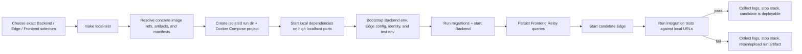
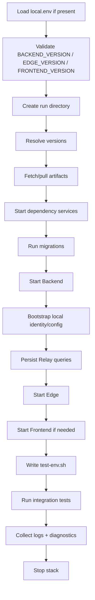
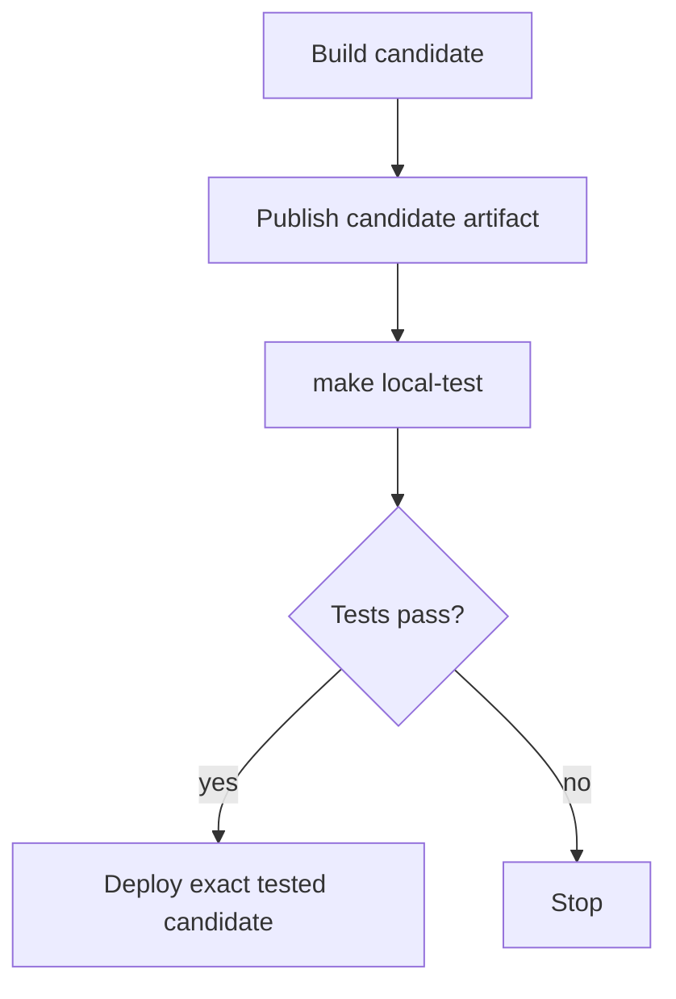

# Local Environment v1

> Run `wasmer-integration-tests` against a fully local Wasmer stack with one command, while injecting candidate Backend / Edge / Frontend versions from PR pipelines before deployment.

## TL;DR

The end result is a **one-command, fully local Wasmer integration-test gate**.
Instead of running `wasmer-integration-tests` against an already-deployed dev,
staging, or prod environment, this repo can spin up its own disposable Wasmer
stack on high, non-conflicting localhost ports, inject exact Backend / Edge /
Frontend candidates, run the normal Jest integration tests against that stack,
and then tear everything down while keeping enough logs to debug failures.

In practice, this means:

- Backend PRs can test a candidate Backend image against prod-equivalent Edge +
  Frontend inputs **before deploying that Backend anywhere**.
- Edge PRs can test a candidate Edge binary artifact against prod-equivalent
  Backend + Frontend inputs **before deploying that Edge anywhere**.
- Frontend PRs/releases can test a candidate Frontend runtime/Relay manifest
  against prod-equivalent Backend + Edge inputs.
- Combined Backend + Edge changes can be tested together by passing both exact
  candidates.
- Local developers and CI use the same command and the same version selector
  contract.

Local developer flow:

```bash
cp local.env.example local.env
# edit BACKEND_VERSION / EDGE_VERSION / FRONTEND_VERSION if needed
make local-test
```

CI / PR gate flow uses the same command:

```bash
make local-test
```

The only difference is where versions come from:

- local: `local.env`
- CI: reusable workflow inputs mapped into `BACKEND_VERSION`, `EDGE_VERSION`,
  and `FRONTEND_VERSION`

The local stack contains the pieces needed for tests to behave like they are
hitting a real Wasmer environment:

- Backend from the selected Backend image, exposed at
  `http://localhost:18000/graphql`
- Edge from the selected Edge binary/artifact, exposed at
  `http://127.0.0.1:19080`
- optional Frontend runtime and Relay persisted query manifest
- Postgres, Redis, MySQL app databases, MinIO, ClickHouse, Loki, and Vector
- generated Backend env, Edge config, test env, logs, and diagnostics under
  `.local-platform/runs/<timestamp>-<sha>/`

A successful run proves: **the exact selected candidate artifacts can boot in a
local Wasmer stack, bootstrap required state, serve apps through Edge, and pass
`wasmer-integration-tests` before deployment.**



### Docker Compose architecture

`make local-test` creates one isolated Docker Compose project named like
`wit_<timestamp>_<sha>`. Think of it as four layers:

- **Host-side control plane**
  - `local-platform/scripts/local-test.sh`
    - creates the run directory;
    - resolves selected Backend / Edge / Frontend versions;
    - starts and stops Docker Compose;
    - runs tests;
    - collects logs and diagnostics.
  - `.local-platform/runs/<run>/`
    - `resolved.env` / `resolved.json`: concrete selected artifacts;
    - `backend.env`: generated Backend runtime environment;
    - `test-env.sh`: environment sourced before running Jest;
    - `edge/platform_config.yaml`: generated Edge runtime config; it is
      gitignored and may contain only run-scoped local credentials generated by
      Backend bootstrap;
    - `artifacts/edge`: selected Edge binary mounted into the Edge container;
    - `artifacts/relay-persisted-queries.json`: selected Frontend Relay manifest;
    - `diagnostics/package-seed.json`: discovered/resolved package dependencies
      mirrored into the local registry;
    - `logs/` and `diagnostics/`: enough state to debug failures after teardown.

- **Candidate services under test**
  - `backend`
    - image: `${BACKEND_IMAGE_REF}`;
    - host endpoint: `http://localhost:18000/graphql`;
    - consumes `backend.env` and talks to the local dependency layer.
  - `edge`
    - image: tiny local Edge runtime image;
    - binary: mounted from `.local-platform/runs/<run>/artifacts/edge`;
    - config: mounted from `.local-platform/runs/<run>/edge/platform_config.yaml`;
    - host endpoints:
      - HTTP: `http://127.0.0.1:19080`;
      - HTTPS: `https://127.0.0.1:19443`;
      - SSH/SFTP: `ssh://127.0.0.1:19022`;
      - Node API/gRPC: `19050` / `19051`;
      - DNS: `127.0.0.1:19053`.
  - `frontend` _(optional)_
    - only started when a Frontend runtime/image is supplied;
    - host endpoint: `http://localhost:13000`;
    - Relay persisted queries are handled separately by posting the selected
      manifest into Backend.

- **One-shot Backend helper runs**
  - migration helper
    - uses the same `${BACKEND_IMAGE_REF}` as `backend`;
    - runs `smbe db migrate up` against local Postgres.
  - bootstrap helper
    - uses the same `${BACKEND_IMAGE_REF}` as `backend`;
    - runs `smbe local-dev-env`;
    - writes `backend.env` and `test-env.sh` into the run directory;
    - captures the ephemeral Edge sync token only long enough to generate Edge
      config; `logs/bootstrap.log` is redacted;
    - generates `edge/platform_config.yaml` from local bootstrap outputs, without
      any checked-in registry tokens or dev/prod registry fallback;
    - seeds local identity/config primitives required by tests.
  - Both helpers are invoked with direct `docker run --network <compose-network>`
    instead of `docker compose run`, which avoids Compose CLI hangs observed with
    one-shot containers.

- **Local dependency layer**
  - Datastores:
    - `postgres`: `localhost:15432`;
    - `redis`: `localhost:16379`;
    - `mysql_app_db_1`: `localhost:13306`;
    - `mysql_app_db_2`: `localhost:13307`;
    - `minio_persistent`: `localhost:19100` / `localhost:19101`;
    - `clickhouse`: `localhost:18123` / `localhost:19123`.
  - Telemetry:
    - `vector`: `localhost:19089`;
    - `loki`: `localhost:13100`.

Test traffic is intentionally simple:

- Jest uses `WASMER_REGISTRY=http://localhost:18000/graphql` to talk to Backend.
- Jest uses `EDGE_SERVER=http://127.0.0.1:19080` to send app traffic through
  Edge.
- Jest uses `EDGE_SSH_SERVER=ssh://127.0.0.1:19022` for SSH/SFTP tests.
- Backend and Edge use Docker-internal service names to talk to Postgres, Redis,
  MinIO, ClickHouse, Vector, and each other.

### Secret and registry safety

No checked-in local-platform file should contain registry tokens. Local Edge is
configured with exactly one package registry: the local Backend inside the Docker
Compose network (`http://backend:8000/graphql`). It must not fall back to the dev,
prod, or public registry at runtime.

The generated run directory may contain ephemeral local credentials created by
`smbe local-dev-env`, including the Edge sync token used by Edge to read from the
local Backend. These files live under `.local-platform/`, are gitignored, and are
valid only for that disposable local run.

## Local package dependency seeding

A newly bootstrapped local Backend registry is empty. Many integration tests build
or deploy packages whose `wasmer.toml` depends on public packages such as
`php/php-eh`, `php/php`, `wasmer/python`, `wasmer/winterjs`, or
`wasmer/static-web-server`. If those dependency versions do not exist in the
local registry, package build/publish fails with errors like:

```text
Dependency php/php-eh@=8.3.404-beta.4 does not exist!
```

`make local-test` fixes this by mirroring required packages into the disposable
local registry after Backend is healthy and before Edge/tests start:

1. `local-platform/scripts/seed-packages.mjs` discovers package requirements
   from:
   - `wasmer.toml` files under `wasmopticon`, tests, fixtures, and `src/app`;
   - TypeScript/JavaScript string literals that look like package dependencies
     or direct CLI package refs;
   - the manual additive list in `local-platform/package-seed.txt`.
2. Each requirement is resolved against
   `LOCAL_PLATFORM_PACKAGE_SOURCE_REGISTRY` (default:
   `https://registry.wasmer.io/graphql`) using Backend's normal semver resolver.
   For example, `php/php@8.*` resolves to the concrete latest matching version
   in the source registry.
3. Resolved transitive package dependencies are added to the seed plan.
4. The selected package artifact is downloaded with `wasmer package download` and
   cached under `.local-platform/package-cache/`.
5. Missing public namespaces such as `php`, `python`, and `wasmer` are created in
   the local registry.
6. The artifact is uploaded through Backend's `generateUploadUrl` /
   `publishPackage` GraphQL mutations with the original `namespace/name@version`.
   If a legacy artifact is rejected because it is not webc v3, the script unpacks
   and rebuilds it with `wasmer package build`, caches the rebuilt `.v3.webc`,
   and retries the publish.
7. The seed plan and result are written to
   `.local-platform/current/diagnostics/package-seed.json`.
8. Before Edge starts, `local-platform/scripts/ensure-compiled.sh` reads the
   resolved seed plan plus `local-platform/package-compilation-list.txt` and runs
   `edge local ensure-compiled --scan-filesystem` inside the Edge runtime
   container. This warms the same `/data` compiler cache volume that the Edge
   server uses during tests, avoiding first-request cold compilation timeouts.

Manual additions:

```text
# local-platform/package-seed.txt
namespace/name          # latest version from the source registry
namespace/name@1.2.3    # exact version
namespace/name@=1.2.3   # exact semver constraint
namespace/name@^1.2.0   # semver range
namespace/name 1.*      # whitespace form
```

Useful knobs:

```bash
# Disable seeding only when debugging the bootstrap path itself.
export LOCAL_PLATFORM_SEED_PACKAGES=0

# Mirror from another registry, for example dev/staging.
export LOCAL_PLATFORM_PACKAGE_SOURCE_REGISTRY=https://registry.wasmer.io/graphql
export LOCAL_PLATFORM_PACKAGE_SOURCE_TOKEN=...

# Add namespaces beyond the default wasmer,php,python dependency allowlist.
export LOCAL_PLATFORM_PACKAGE_NAMESPACE_ALLOWLIST=wasmer,php,python,myteam

# Direct string refs are more conservative to avoid matching fixture paths;
# by default only wasmer/* refs like `wasmer/bash` are auto-added this way.
export LOCAL_PLATFORM_PACKAGE_DIRECT_REF_NAMESPACE_ALLOWLIST=wasmer,myteam

# Scan different roots or use a different manual list.
export LOCAL_PLATFORM_PACKAGE_SCAN_DIRS=tests,wasmopticon,fixtures,src/app
export LOCAL_PLATFORM_PACKAGE_SEED_FILE=local-platform/package-seed.txt

# Disable precompilation only when debugging startup/compilation itself.
export LOCAL_PLATFORM_ENSURE_COMPILED=0

# Compile additional engines or limit per-compilation threads.
export LOCAL_PLATFORM_ENSURE_COMPILED_ENGINES=wasmer-cranelift
export LOCAL_PLATFORM_ENSURE_COMPILED_THREADS=1

# Add extra packages that are not part of package seeding yet.
# See local-platform/package-compilation-list.txt.
```

The source token is optional for public packages. Do not commit tokens in
`local.env` or documentation.

## Local version config

Add a gitignored `local.env` at repo root.

Example:

```bash
# local.env
export BACKEND_VERSION=resolve_prod
export EDGE_VERSION=resolve_prod
export FRONTEND_VERSION=resolve_prod

# Optional: override the test command.
# export LOCAL_TEST_COMMAND='pnpm exec jest ./tests/general/'
```

Example: test a Backend candidate against prod Edge + Frontend:

```bash
export BACKEND_VERSION=v2026-06-02_1_bb55bb_dev1
export EDGE_VERSION=resolve_prod
export FRONTEND_VERSION=resolve_prod
```

Example: test an Edge PR artifact against prod Backend + Frontend:

```bash
export BACKEND_VERSION=resolve_prod
export EDGE_VERSION=artifact:wasmerio/edge:123456789:edge-linux-x86_64
export FRONTEND_VERSION=resolve_prod
```

`local.env.example` should default all services to prod:

```bash
export BACKEND_VERSION=resolve_prod
export EDGE_VERSION=resolve_prod
export FRONTEND_VERSION=resolve_prod
export LOCAL_TEST_COMMAND='pnpm exec jest ./tests/general/'
```

## Single command contract

`make local-test` owns the full journey:



The command should be safe to rerun:

- create a fresh run directory;
- use deterministic Docker Compose project name per run;
- write all generated env/config/logs under that run directory;
- stop the stack at the end;
- keep the run directory on failure.

## Version selectors

The workflow and local command use homogeneous names:

```yaml
backend_version: <selector>
edge_version: <selector>
frontend_version: <selector>
```

Locally those map to:

```bash
BACKEND_VERSION=<selector>
EDGE_VERSION=<selector>
FRONTEND_VERSION=<selector>
```

### Selector values

| Selector                                   | Meaning                                                                                                                                       |
| ------------------------------------------ | --------------------------------------------------------------------------------------------------------------------------------------------- |
| `resolve_prod`                             | Resolve the currently deployed production version for that service.                                                                           |
| `v2026-...`                                | Use a released version/tag. Interpretation is service-specific.                                                                               |
| Full Backend image ref                     | Allowed for Backend when a PR pipeline already produced an exact ECR ref.                                                                     |
| `artifact:<repo>:<run_id>:<artifact_name>` | Download a GitHub Actions artifact from a specific run. Primary path for Edge PR binaries.                                                    |
| `github-artifact:<repo>:<artifact_name>`   | Download the latest GitHub Actions artifact with that exact name across runs. Useful for pinned Backend CI image archives without ECR access. |
| `path:/absolute/path`                      | Developer escape hatch for local binaries/manifests.                                                                                          |

### `resolve_prod` semantics

| Service  | Source of truth                                                                                  | Resolver output                                   |
| -------- | ------------------------------------------------------------------------------------------------ | ------------------------------------------------- |
| Backend  | Current prod Helm/Kubernetes `stackmachine-core` image.                                          | `BACKEND_IMAGE_REF=<ecr>/stackmachine:<tag>`      |
| Edge     | Current active prod Edge release, resolved from production Edge/Node API or deployment metadata. | Downloaded Edge binary path.                      |
| Frontend | Current prod Frontend deployment metadata.                                                       | Frontend runtime artifact/image + Relay manifest. |

`EDGE_VERSION=resolve_dev` resolves the latest `wasmerio/edge` GitHub release
whose tag ends in `_dev1` (override with `EDGE_DEV_RELEASE_SUFFIX`) and downloads
the matching release asset. CI can use this to track the latest Edge binary
pushed to the dev environment without touching ECR or Kubernetes.

Rules:

- `resolve_prod` is explicit, not a silent fallback.
- Empty `BACKEND_VERSION`, `EDGE_VERSION`, or `FRONTEND_VERSION` fails fast.
- The resolver prints concrete image refs, release tags, artifact run ids, and paths before starting the stack.
- Deployment must use the same candidate version that passed tests.

## Isolated ports

The local integration environment must not collide with Backend repo local development.

Backend local env commonly uses:

- Backend: `8000`
- Frontend: `3000`
- Edge HTTP/HTTPS: `80` / `443`
- Edge Node API/gRPC: `9050` / `9051`
- Edge SSH/DNS: `9022` / `9053`

Use a separate port range for this repo:

| Service                  | Container port |   Host port |
| ------------------------ | -------------: | ----------: |
| Backend HTTP             |         `8000` |     `18000` |
| Frontend HTTP            |         `3000` |     `13000` |
| Edge HTTP                |         `9080` |     `19080` |
| Edge HTTPS               |         `9443` |     `19443` |
| Edge Node API            |         `9050` |     `19050` |
| Edge gRPC                |         `9051` |     `19051` |
| Edge SSH/SFTP            |         `9022` |     `19022` |
| Edge DNS                 |     `9053/udp` | `19053/udp` |
| Postgres                 |         `5432` |     `15432` |
| Redis                    |         `6379` |     `16379` |
| MySQL app DB 1           |         `3306` |     `13306` |
| MySQL app DB 2           |         `3306` |     `13307` |
| MinIO persistent API     |         `9000` |     `19100` |
| MinIO persistent console |         `9001` |     `19101` |
| ClickHouse HTTP          |         `8123` |     `18123` |
| ClickHouse native        |         `9000` |     `19123` |
| Loki                     |         `3100` |     `13100` |
| Vector HTTP              |         `9089` |     `19089` |

Generated test env:

```bash
export WASMER_REGISTRY="http://localhost:18000/graphql"
export WASMER_APP_DOMAIN="localhost"
export EDGE_SERVER="http://127.0.0.1:19080"
export EDGE_SSH_SERVER="ssh://127.0.0.1:19022"
export EDGE_DNS_SERVER="127.0.0.1:19053"
```

`TestEnv.fetchApp()` already supports `EDGE_SERVER` by rewriting requests while preserving the original `Host` header.

Each host port can be overridden with the corresponding `*_PORT` environment
variable when a local machine already has something bound. For example:

```bash
MYSQL_APP_DB_2_PORT=13317 make local-test
```

`make local-test` checks TCP port availability before starting Compose and fails
fast with the override variable name instead of partially starting the stack.

## Run directory and logs

Every `make local-test` creates a run directory:

```text
.local-platform/runs/<timestamp>-<short-sha-or-local>/
  resolved.env
  resolved.json
  test-env.sh
  backend.env
  compose.yaml
  edge/
    platform_config.yaml
    edge-grpc-token.txt
  artifacts/
    edge
    relay-persisted-queries.json
  logs/
    compose.follow.log
    compose.ps.txt
    backend.log
    edge.log
    frontend.log
    postgres.log
    redis.log
    mysql_app_db_1.log
    mysql_app_db_2.log
    minio_persistent.log
    clickhouse.log
    loki.log
    vector.log
    tests.log
  diagnostics/
    docker-compose-ps.json
    docker-compose-config.yaml
    docker-events.log
```

Also update a convenience symlink:

```text
.local-platform/current -> runs/<latest-run>
```

### Required logging behavior

- Start a background log follower as soon as compose starts:

  ```bash
  docker compose logs --no-color --timestamps --follow \
    > "$RUN_DIR/logs/compose.follow.log" 2>&1 &
  ```

- Tee test output:

  ```bash
  $LOCAL_TEST_COMMAND 2>&1 | tee "$RUN_DIR/logs/tests.log"
  ```

- On exit, always snapshot per-service logs:

  ```bash
  docker compose logs --no-color --timestamps backend > "$RUN_DIR/logs/backend.log"
  docker compose logs --no-color --timestamps edge > "$RUN_DIR/logs/edge.log"
  # ...repeat for all services
  ```

- Always write diagnostics:

  ```bash
  docker compose ps > "$RUN_DIR/logs/compose.ps.txt"
  docker compose ps --format json > "$RUN_DIR/diagnostics/docker-compose-ps.json"
  docker compose config > "$RUN_DIR/diagnostics/docker-compose-config.yaml"
  ```

### Failure retention

On success:

- stop and remove containers;
- keep the latest run directory locally, or prune old successful runs later.

On failure:

- stop containers after log collection;
- keep the full run directory;
- in CI, upload the run directory as an artifact.

Workflow artifact upload:

```yaml
- name: Upload local platform logs
  if: failure()
  uses: actions/upload-artifact@v4
  with:
    name: local-platform-${{ github.run_id }}-${{ github.run_attempt }}
    path: .local-platform/current
    if-no-files-found: error
```

This artifact must contain enough information to debug without rerunning:

- resolved versions;
- generated env/config;
- service logs;
- test logs;
- compose diagnostics.

## Make targets

Minimum Makefile API:

```makefile
.PHONY: local-test local-platform-up local-platform-down local-platform-logs

local-test:
	bash ./local-platform/scripts/local-test.sh

local-platform-up:
	bash ./local-platform/scripts/up.sh

local-platform-down:
	bash ./local-platform/scripts/down.sh

local-platform-logs:
	bash ./local-platform/scripts/print-logs.sh
```

`local-platform-up` starts the same local platform without running tests or tearing it down. It leaves `.local-platform/current` pointing at the running stack, writes `test-env.sh`, keeps a background Compose log follower, and should be stopped with `make local-platform-down`.

`local-test.sh` should:

1. load `local.env` if present;
2. default missing versions to `resolve_prod` only for local interactive use or from `local.env.example`;
3. fail on empty versions in CI;
4. create `$RUN_DIR`;
5. resolve versions;
6. fetch artifacts / pull images;
7. start services;
8. bootstrap;
9. run tests;
10. collect logs;
11. stop services;
12. exit with the test status.

## Reusable workflow shape

Add:

```text
.github/workflows/local-platform-test.yaml
```

```yaml
on:
  workflow_call:
    inputs:
      backend_version:
        type: string
        required: true
      edge_version:
        type: string
        required: true
      frontend_version:
        type: string
        required: true
      test_command:
        type: string
        default: pnpm exec jest ./tests/general/
```

Workflow skeleton:

```yaml
jobs:
  test:
    runs-on: ubuntu-24.04
    steps:
      - uses: actions/checkout@v4

      - uses: pnpm/action-setup@v4
        with:
          version: 10

      - run: make setup

      - name: Run local platform tests
        env:
          BACKEND_VERSION: ${{ inputs.backend_version }}
          EDGE_VERSION: ${{ inputs.edge_version }}
          FRONTEND_VERSION: ${{ inputs.frontend_version }}
          LOCAL_TEST_COMMAND: ${{ inputs.test_command }}
          GH_TOKEN: ${{ github.token }}
        run: make local-test

      - name: Upload local platform logs
        if: failure()
        uses: actions/upload-artifact@v4
        with:
          name: local-platform-${{ github.run_id }}-${{ github.run_attempt }}
          path: .local-platform/current
          if-no-files-found: error
```

## Producer workflow examples

### Backend PR gate

```yaml
jobs:
  integration-tests:
    needs: build-backend-image
    uses: wasmerio/wasmer-integration-tests/.github/workflows/local-platform-test.yaml@main
    with:
      backend_version: ${{ needs.build-backend-image.outputs.image_ref }}
      edge_version: resolve_prod
      frontend_version: resolve_prod
    secrets: inherit
```

### Edge PR gate

```yaml
jobs:
  integration-tests:
    needs: build-edge-binary
    uses: wasmerio/wasmer-integration-tests/.github/workflows/local-platform-test.yaml@main
    with:
      backend_version: resolve_prod
      edge_version: artifact:wasmerio/edge:${{ github.run_id }}:edge-linux-x86_64
      frontend_version: resolve_prod
    secrets: inherit
```

### Combined Backend + Edge gate

```yaml
with:
  backend_version: ${{ needs.backend.outputs.image_ref }}
  edge_version: artifact:wasmerio/edge:${{ needs.edge.outputs.run_id }}:edge-linux-x86_64
  frontend_version: resolve_prod
```

## Backend

Backend runs from the resolved image:

```yaml
backend:
  image: ${BACKEND_IMAGE_REF}
  env_file:
    - ${RUN_DIR}/backend.env
  ports:
    - "18000:8000"
```

Migrations run as one-shot containers using the same image:

```bash
docker compose run --rm backend-migrate smbe db migrate up
```

## Edge without an Edge image

Use a tiny runtime image that only supplies OS libraries. Mount the downloaded Edge binary.

```yaml
edge:
  build:
    context: ./local-platform/edge-runtime
  entrypoint: ["/usr/local/bin/edge"]
  command:
    - run
    - --dev
    - --http-port
    - "9080"
    - --https-port
    - "9443"
    - --data-dir
    - /data
    - -c
    - /config/platform_config.yaml
  volumes:
    - ${RUN_DIR}/artifacts/edge:/usr/local/bin/edge:ro
    - ${RUN_DIR}/edge/platform_config.yaml:/config/platform_config.yaml:ro
  ports:
    - "19080:9080"
    - "19443:9443"
    - "19050:9050"
    - "19051:9051"
    - "19022:9022"
    - "19053:9053/udp"
```

## Bootstrap

Long-term: bootstrap through Backend GraphQL/CLI surfaces owned by integration-tests.

V1 bridge: call released Backend image helper for primitives that are not yet public APIs:

```bash
docker compose run --rm backend-bootstrap \
  smbe local-dev-env \
    --namespace wasmer-integration-tests \
    --public-url http://localhost:18000 \
    --app-domain localhost \
    --edge-server http://127.0.0.1:19080 \
    --edge-ssh-server ssh://127.0.0.1:19022 \
    --edge-dns-server 127.0.0.1:19053 \
    --write-test-env /platform/test-env.sh \
    --write-backend-env /platform/backend.env \
    --write-edge-config /platform/edge/platform_config.yaml \
    --skip-templates
```

After token/config exists, package/template setup should move into this repo and use GraphQL/CLI helpers.

## Relay persisted queries

Frontend release builds can contain persisted Relay ids with `text: null`. The local Backend must have those query texts persisted.

Frontend local-platform bundles/releases must include:

```text
relay-persisted-queries.json
```

Shape:

```json
[
  {
    "name": "DashboardQuery",
    "id": "ba410b468a5d8d9465ea873255c80f42",
    "text": "query DashboardQuery { viewer { id } }"
  }
]
```

Bootstrap posts each query to Backend:

```bash
curl -fsS http://localhost:18000/graphql/persist \
  -H 'content-type: application/json' \
  --data '{"text":"query DashboardQuery { viewer { id } }"}'
```

This keeps `wasmer-integration-tests` free of frontend source/submodules while making a pinned frontend release deterministic.

## Deployment gate rules



- Producer workflows pass exact `*_version` selectors.
- `resolve_prod` is allowed only when the desired comparison target is current production.
- `make local-test` is the same command locally and in CI.
- The resolver prints concrete image refs, release tags, artifact run ids, and binary paths.
- Deployment consumes the same candidate that tests consumed.
- Empty CI inputs fail. Silent fallback to prod is not allowed.
- On failure, `.local-platform/current` is uploaded as a CI artifact.

## Minimal v1 deliverables

- `local.env.example`
- `make local-test`
- `local-platform` scripts:
  - `local-test.sh`
  - `resolve.sh` / `resolve.ts`
  - `fetch-artifacts.sh` / `fetch-artifacts.ts`
  - `bootstrap.sh` / `bootstrap.ts`
  - `down.sh`
  - `collect-logs.sh`
- `docker-compose.local-platform.yaml`
- Edge runtime Dockerfile, not an Edge build Dockerfile.
- Reusable workflow: `.github/workflows/local-platform-test.yaml`.
- Backend PR workflow passes `backend_version`.
- Edge PR workflow passes `edge_version`.
- Frontend PR/release workflow passes `frontend_version` and supplies `relay-persisted-queries.json`.
- CI failure artifact upload for `.local-platform/current`.

## Non-goals for v1

- Building Backend or Edge from source in this repo.
- Cloning Backend / Edge / Frontend submodules.
- Replacing all `smbe local-dev-env` behavior on day one.
- Running Edge on privileged `:80/:443`; isolated high ports are required.
